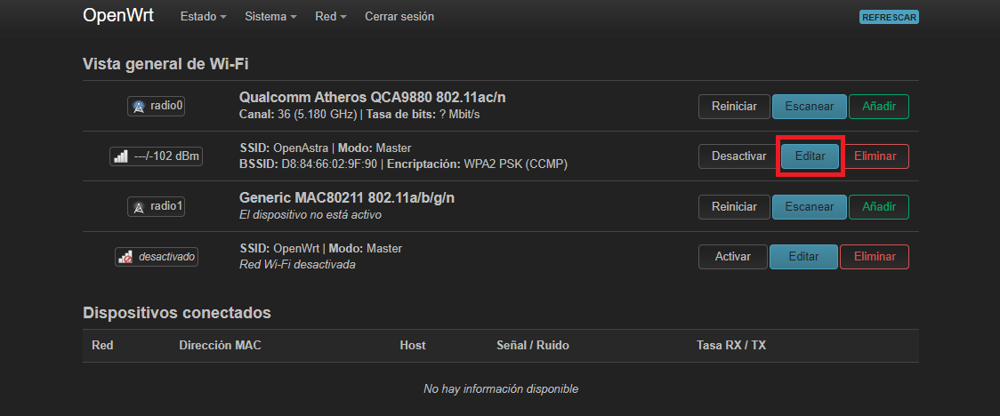
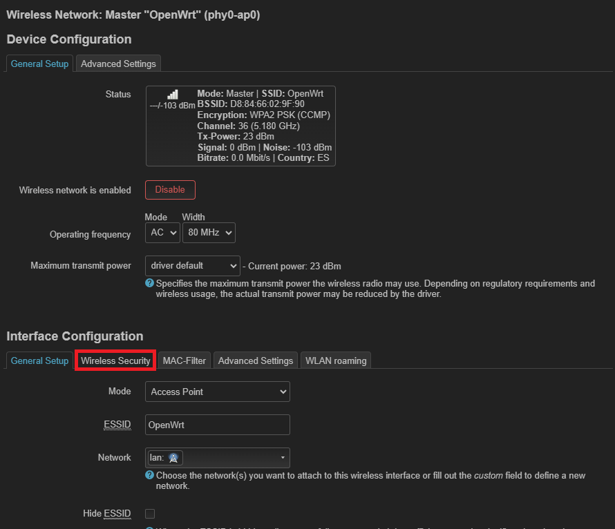
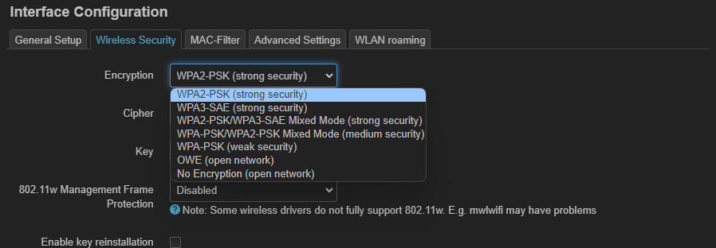
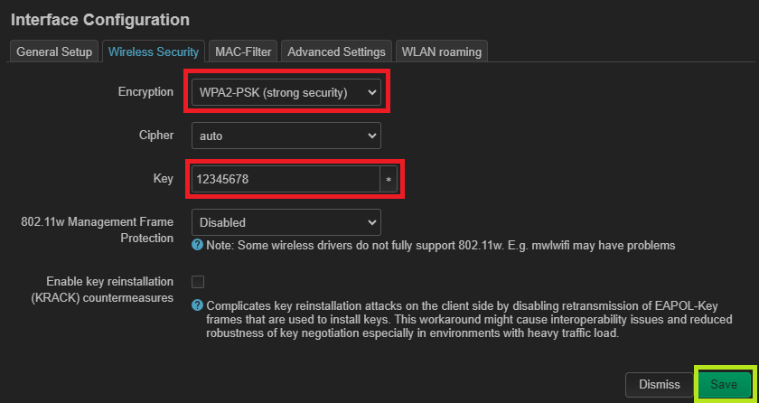
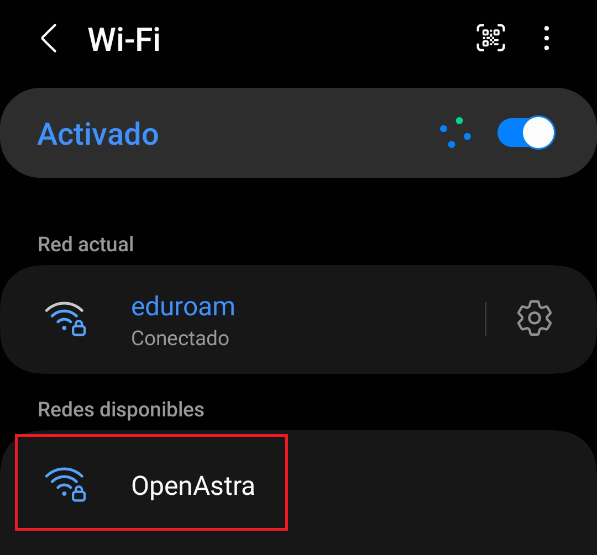
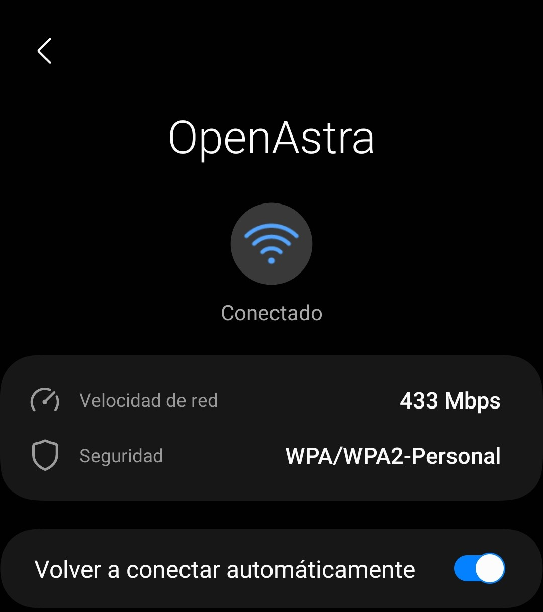

Habilitar WPA2/PSK en una Red OpenWRT
---
Para la configuración de un sistema para proteger las redes inalámbricas WPA2/PSK, se utilizará la interfaz Web LuCi, que se puede acceder a ella escribiendo en el navegador la Ip del dispositivo como se indica en la documentación de la configuración de esta interfaz.

**1. Paso:**  Una vez dentro de la interfaz web, entremos en la sección : 
```network >> wireless ```


**2. Paso:**  Nos mostrará toda las interfaces de red que disponemos, nosotros vamos a editar la interfaz de radio física principal que es el SSID del ***Radio 0*** .


**3. Paso:** Dentro de la interfaz de rede principal, nos dirigimos a ```Wireless Security``` para cambiarseleccionar un sistema de seguridad.


**4. Paso:** Seleccionamos el sistema que más se prefiera, en este caso se selecciona el recomendado que es WPA2/PSK.


**5. Paso:** Añadimos una contraseña para poder acceder a la conexión de estar red desde otro dispositivo.


Observamos como se visualiza nuestra red en un dispositivo movil, donde aparece como una red privada que usa el sistema de seguridad WPA2 para poder conectarse a internet.

  

