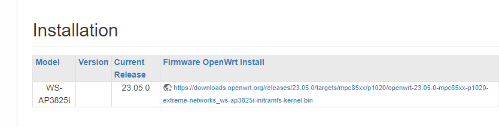
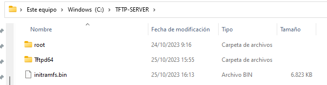
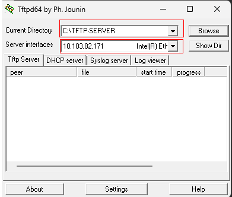
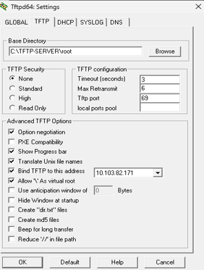
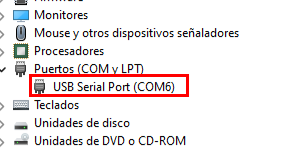
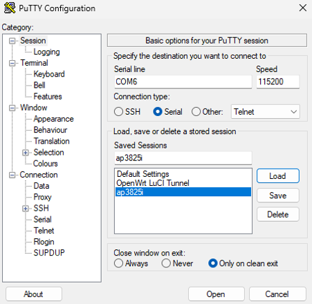
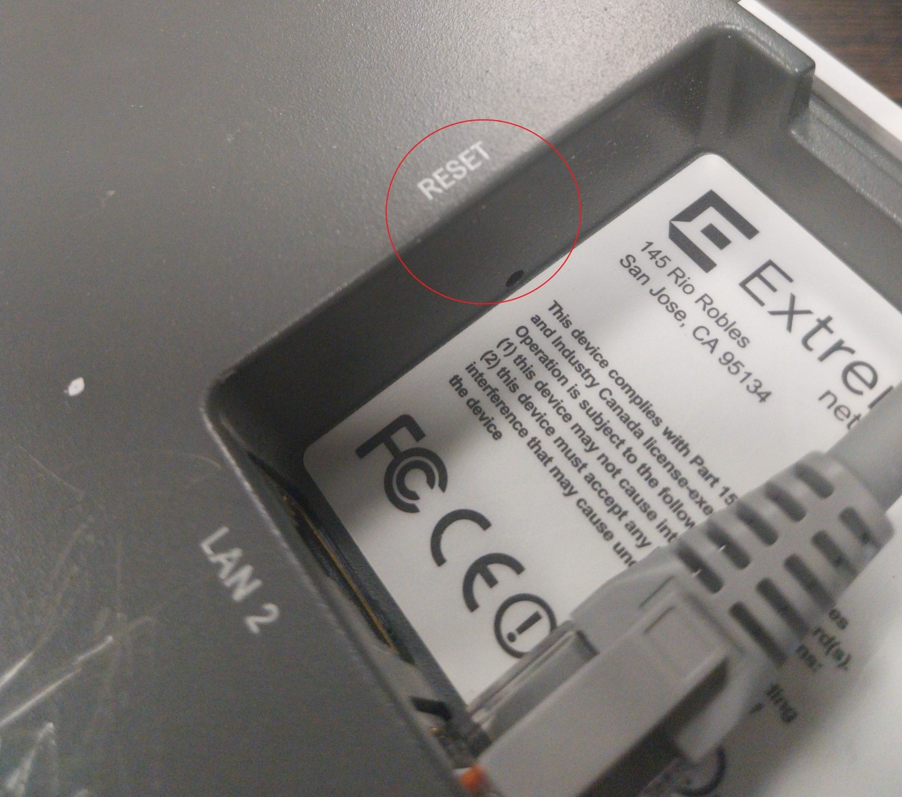
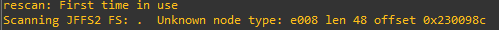
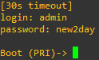
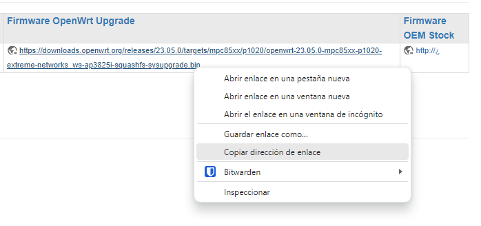

# Instalación de OpenWRT en Extreme Networks WS-AP3825i / WS-AP3825E
Para la instalación y configuración de OpenWRT, deberemos de disponer de [PuTTY](https://www.putty.org/) y [Tftpd64](https://pjo2.github.io/tftpd64/).

**1. Paso:** instalar tftp64 y guardarlo en una carpeta que llamaremos ```C:\TFTP-SERVER``` .

**2. Paso:**  instalar [Firmware OpenWRT](https://openwrt.org/toh/extreme_networks/ws-ap3825i).



**3. Paso:** guardar el archivo fireware como ***initramfs.bin*** y moverlo a *C:\TFTP-SERVER* .


**4. Paso:**  abrir tftp64 y añadir la siguiente configuración.



- **Current Directory:** colocar la ubicación donde este initramfs.bin
- **Server interfaces:** es la Ip del propio dispositivo.

**5. Paso:** instalar PuTTY.

**6. Paso:** conectar Extreme Networks WS-AP3825i / WS-AP3825E mediante cable serial al ordenador.

**7. Paso:**	comprobar que clave de serial port se le asigna en el **Administrador de dispositivos >> Puetos (COM y LPT)**.



**8. Paso:** configurar PuTTY en la parte de Session con los datos de la imagen.



**9. Paso:** darle a Open, una vez en la terminal que se muestra añadir username: admin, password: new2day .

```json
{
"Login": "admin",
"Password": "new2day"
}
```
**NOTA:** el dispositivo deberá tener los valores de fabrica para que funcione, en el caso de que no este, habrá que resetearlo de forma manual, pulsando el boton que esta en el dispositivo que pone ```reset```.




**10. Paso:** una vez arranque darle escribir ***reboot*** >> presionar ***enter*** , cuando cargue en el momento que aparezca la palabra  ***“Scanning JFFS2 FS”*** , presionar ***enter***  y entrará en el modo ***U-BOOT*** .

 

**11. Paso:** una vez dentro hay que modificar y sustituir lo que en el comando esta con *<<<>>>*:

**ipv4 direccion del cliente:** dirección ip del dispositivo WS-AP3825i / WS-AP3825E

**tftp dirección de servidor:** dirección del servidor (dispositivo donde se ha abierto el servidor en tftp64)

```Json
setenv ramboot_openwrt "setenv ipaddr <<ipv4 direccion del cliente>>; setenv serverip <<tftp dirección de servidor>>; tftpboot 0x2000000 initramfs.bin; interrupts off; bootm start 0x2000000; bootm loados; fdt resize; fdt boardsetup; fdt resize; fdt boardsetup; fdt chosen; fdt resize; fdt chosen; bootm prep; bootm go;"

setenv boot_openwrt "cp.b 0xEC000000 0x2000000 0x2000000; interrupts off; bootm start 0x2000000; bootm loados; fdt resize; fdt boardsetup; fdt chosen; bootm prep; bootm go;"

setenv bootcmd "run boot_openwrt";

saveenv

run ramboot_openwrt
```
**NOTA:** ejecutar ```ifconfig``` para mostrar la dirección IP del cliente

**12. Paso:** copiar y pegar en el U boot cada apartado del comando anterior (**es importante que se haga por apartados y no todo los comandos a la vez**) .


**13. Paso:** actualizar sistema (***Sysupgrade***) , en el caso de que este conectado el cable al Lan 2, cambiarlo al Lan 1 y seguir los comandos siguientes.

Link de descargar de la actualización: [Firmware OpenWRT Upgrade](https://openwrt.org/toh/extreme_networks/ws-ap3825i).


Copiamos el nombre y extensión completa del archivo.


```json
cd /tmp

wget <link de descargar de la actualización>

sysupgrade -n /tmp/<nombre del archivo completo de la actualización.bin>
```
**14. Paso:** la instalación finalizará cuando La luz de encendido cambiará de intermitente a fija y aparecerá el siguiente mensaje en PuTTY.

```json
[360.759221] done.
[360.761174] jffs2: notice: (3432) jffs2_build_xattr_subsystem: complete building xattr subsystem, 0 of xdatum (0 unchecked, 0 orphan) and 0 of xref (0 dead, 0 orphan) found.
[361.182281] overlayfs: upper fs does not support tmpfile.
```
Ya estaría listo la instalación de OpenWRT en nuestro AP Extreme Networks.